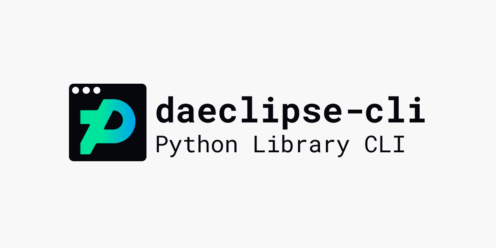

# daeclipse-cli


[](https://pypi.org/project/daeclipse-cli/) [](https://pypi.org/project/daeclipse-cli/) [](https://github.com/Pepper-Wood/daeclipse-cli/blob/main/LICENSE)

[daeclipse-cli](https://pypi.org/project/daeclipse-cli/) is a handy CLI wrapper around the reverse-engineered [daeclipse](https://github.com/Pepper-Wood/daeclipse) Python library for DeviantArt Eclipse functionality. The purpose is to bundle and present functionality enhancements to aid with dA usability.

```
Usage: daeclipse [OPTIONS] COMMAND [ARGS]...

  DeviantArt Eclipse CLI

Options:
  --install-completion  Install completion for the current shell.
  --show-completion     Show completion for the current shell, to copy it or
                        customize the installation.

  --help                Show this message and exit.

Commands:
  add-art-to-groups  Submit DeviantArt deviation to groups.
  hot-tags           Return top tags on the hottest deviations.
  post-status        Post a DeviantArt status.
  show-tags          Return list of tags for given deviation.
  spammer            Return information and output for spam report helpdesk ticket creation.
  user-comments      Retrieve recent comments made by specified user.
```

## Installation

The Python library is available via https://pypi.org/project/daeclipse-cli/

```bash
pip install daeclipse-cli
```

## Usage

Once installed globally, commands can be run by prefixing with `daeclipse`.
```bash
daeclipse --help
```

For local development, if you clone the repo locally:
```bash
git clone git@github.com:Pepper-Wood/daeclipse.git

poetry run daeclipse --help
```

## Build Status and Checks

CICD is run thorugh GitHub Actions and makes the below checks on the two components of this repository:

| | Python Package |
| --- | --- |
| Lint |  |
| Test | Coming Soon... |
| Deploy |  |

## Contributing

Contributions are always welcome, no matter how large or small! Before contributing, please read the [code of conduct](CODE_OF_CONDUCT.md).

[](CODE_OF_CONDUCT.md)

If you have a feature request, run into a bug, or are unsure about anything, feel free to submit a GitHub issue.

If you are interested in creating a Pull Request, please read the [guide on this repository's development process](docs/development.md).

Commit titles on the `main` branch follow the [emoji-commit-messages](https://github.com/cooperka/emoji-commit-messages) naming convention.

## Caveats / Disclaimer

DeviantArt's history as a website is storied. Prior to the release of Eclipse, there were two options with creating tooling around its UI:
- The [Public DeviantArt API](https://www.deviantart.com/developers/). See [accompanying Python wrapper](https://pypi.org/project/deviantart/). The API is relatively easy to use - and utilizes OAuth2 for authentication - but its endpoints and functionality are sparce. It also was not updated for some time but now appears to be getting a handful of new endpoints based on the changelog.
- The internal [DeviantArt Interactive Fragment Interface (DiFi)](https://github.com/danopia/deviantart-difi/wiki). DiFi has a wide range of functionality but is volatile/unreliable and difficult to use - especially compared to modern APIs.

On October 2019, DeviantArt announced [DeviantArt Eclipse](https://www.deviantart.com/team/journal/DeviantArt-Eclipse-is-Here-814629875), a new UI (mostly) built in React. There are still a handful of pages on the website that expose the old website (i.e. https://www.deviantart.com/groups/) where functionality hasn't been completely ported. But with the new React UI, DeviantArt brought along a third option for tooling:
- The internal **DeviantArt NAPI**, currently undocumented. The structure of its endpoints resembles RESTful practices, and authentication is done through scraping a CSRF token on the website or using a user's stored `.deviantart.com` cookies.

The implementation in this library relies on the DeviantArt NAPI. As such, functionality may break without warning depending on whether the internal DeviantArt team makes changes to these endpoints.
